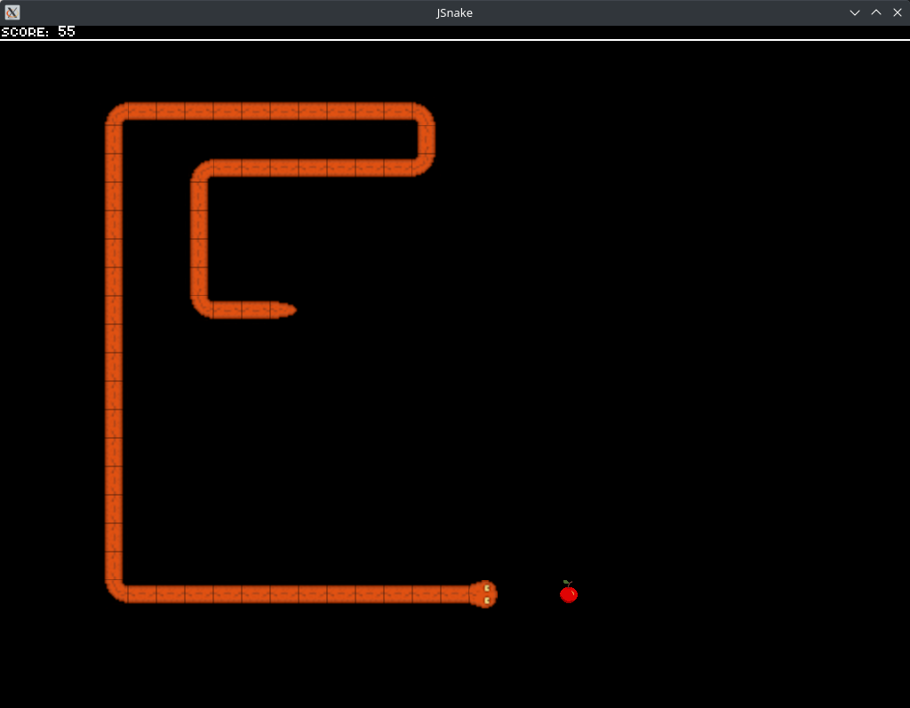
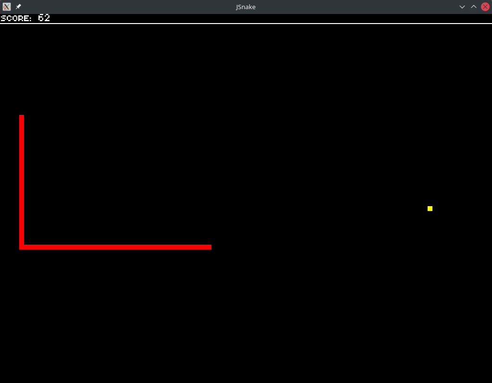

# JSnake

Testing Allegro and Dear Imgui with a little snake game

## Todo

-   [x] Add functionality to options menu
    -   [ ] Improve menu usability and looks 
-   [x] Add Pause screen
-   [x] Add Lose screen
-   [x] Add Hiscores
-   [x] Count points
-   [ ] Cleanup code

### Optional

-   [x] Improve graphics
-   [x] Improve CMakeLists.txt and add portability

### Assets

Font: <https://opengameart.org/content/font-retrospace>

Snake sprites: <https://opengameart.org/content/snake-sprites-sound>

Apple: Me with Asesprite

### Screenshots

