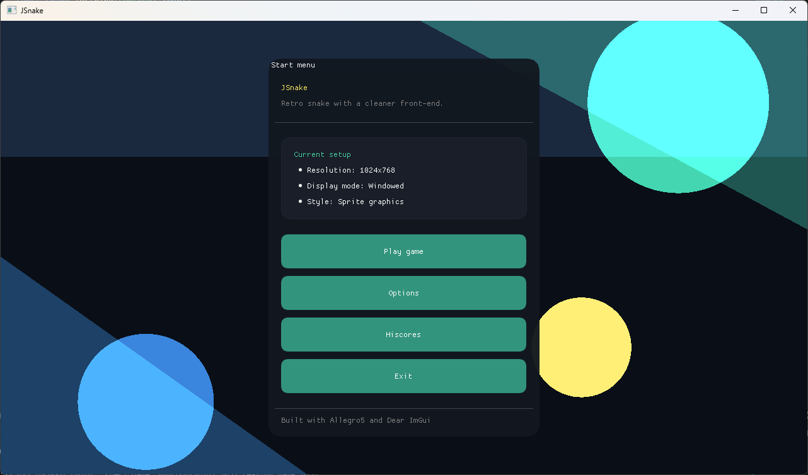
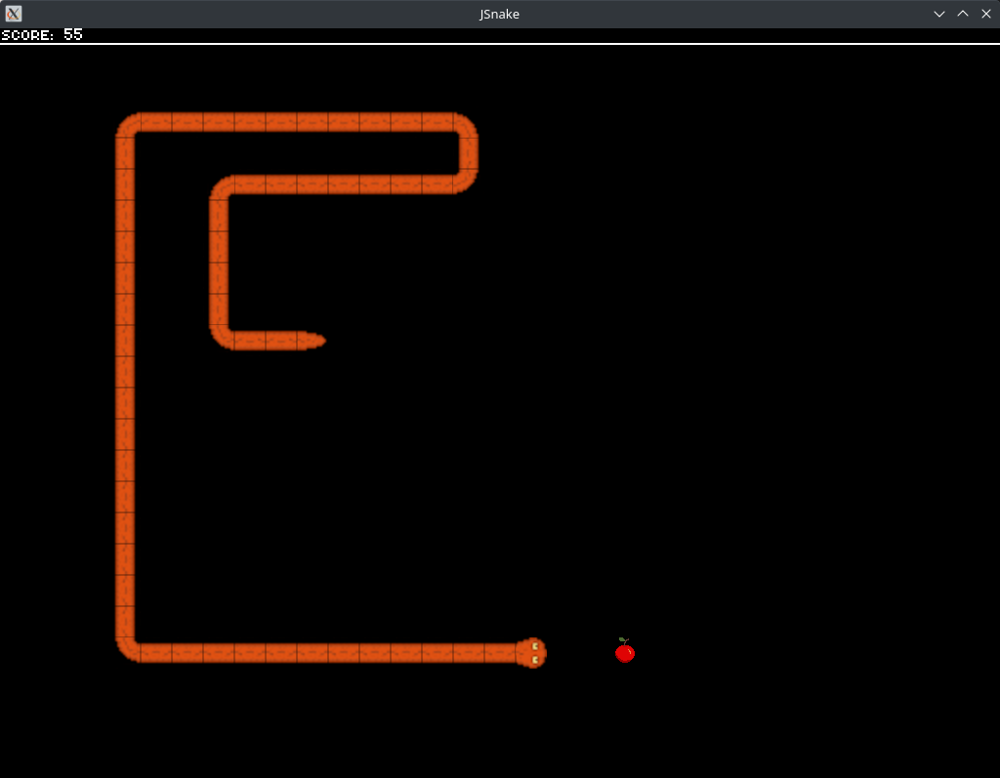
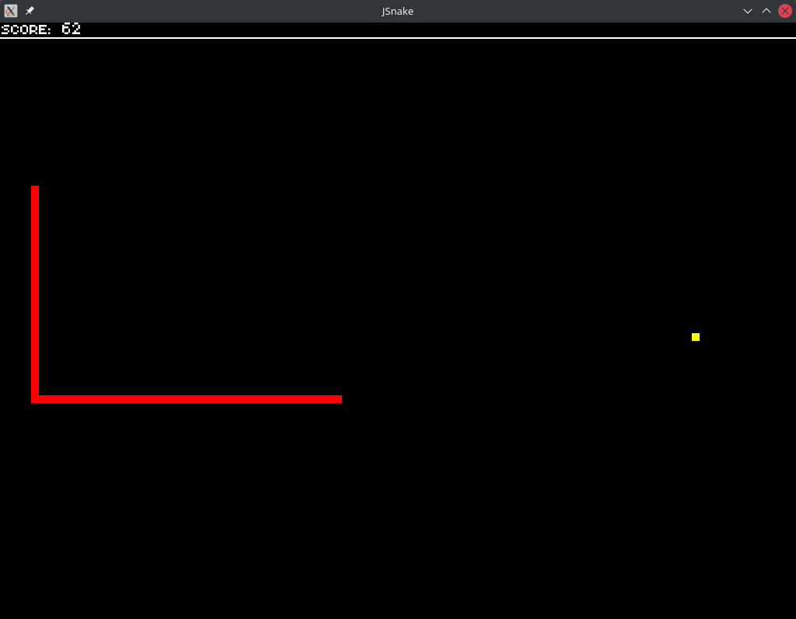

# JSnake

[](https://app.codacy.com/gh/paussu/JSnake?utm_source=github.com&utm_medium=referral&utm_content=paussu/JSnake&utm_campaign=Badge_Grade_Settings)

JSnake is a small C++ snake game built with Allegro 5 and Dear ImGui. It started as a graphics and UI experiment and has grown into a polished desktop game with a configurable menu, sprite and classic visual modes, hiscore saving, and lightweight runtime logging.

## Highlights

- Modern menu UI built with Dear ImGui
- Classic snake gameplay with pause and game-over flows
- Resolution, fullscreen, and visual style options
- Two presentation styles:
    - classic block snake
    - sprite-based snake
- Persistent hiscore saving
- Debug and error logging for startup, asset loading, and gameplay flow
- CMake + preset based build setup for Windows
- vcpkg-based Allegro integration

## Tech Stack

- C++20
- CMake
- Allegro 5
- Dear ImGui
- vcpkg

## Project Layout

```text
include/     Public headers
src/         Game and UI source files
Assets/      Fonts, sprites, screenshots
ImGUI/       Bundled Dear ImGui sources
cmake/       Custom CMake find modules
```

## Gameplay

The goal is simple: keep the snake moving, collect food, and avoid running into yourself.

### Controls

- Move: `WASD` or arrow keys
- Pause: `P`
- Exit run: `Esc`

## Features

### Main Menu

- improved centered layout
- styled background and matching UI palette
- quick overview of the selected configuration

### Options

- resolution selection
- fullscreen toggle
- sprite/classic visual toggle

### Hiscores

- score saving between runs
- simple hall-of-fame screen

### Logging

The project includes a lightweight logger with two levels:

- `Debug` for flow information in development builds
- `Error` for failures such as missing assets or initialization problems

## Building

### Windows

The current setup is configured for Visual Studio 2022 and vcpkg.

#### Requirements

- Visual Studio 2022 with C++ build tools
- CMake 3.21+
- vcpkg installed at `C:/vcpkg`

#### Install dependencies

```powershell
C:\vcpkg\vcpkg.exe install allegro5:x64-windows
```

#### Configure

```powershell
cmake --preset windows-vs2022-debug
```

#### Build

```powershell
cmake --build --preset windows-vs2022-debug
```

The executable will be generated in:

```text
build/windows-vs2022-debug/Debug/JSnake.exe
```

## Assets

The build copies the `Assets` directory next to the executable automatically, so the game can load fonts and sprite textures at runtime.

Credits:

- Font: <https://opengameart.org/content/font-retrospace>
- Snake sprites: <https://opengameart.org/content/snake-sprites-sound>
- Apple sprite: created for the project

## Screenshots

### Main menu



### Sprite mode



### Classic mode



## Notes

- Debug builds are useful for seeing runtime logging output.
- The project currently focuses on desktop Windows development.
- The codebase is split into gameplay, menu/UI, rendering strategies, and support utilities.

## Future Improvements

- additional gameplay polish
- more cleanup and refactoring
- improved persistence paths for saves and hiscores
- expanded release/setup documentation
